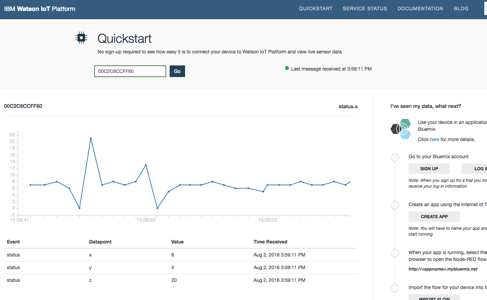

# BLE SensorTag

## Introduction
This BLE SensorTag example collects temperature and humidity data from the TI SensorTag and publishes it to the IBM Bluemix IoT cloud.

## Setup
* Ensure that your Intel® Joule Module has been updated with the latest build of Ostro-GT
* Ensure that your Intel® Joule Module has internet access after setting up WiFi (i.e. using connman)
* Ensure that Bluetooth has been enabled by using the command:
```
rfkill unblock bluetooth
```

You will also need a TI SensorTag (CC2650):


## Running the code
You can launch this project from XDK (after first importing it from XDK IoT Edition), or run it directly on your device:

```
npm install
node index.js
```


## IBM Bluemix IoT
Go to [IBM IoT Quickstart](https://quickstart.internetofthings.ibmcloud.com/#/) and enter your device ID to visualize your accelerometer data.



