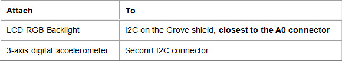
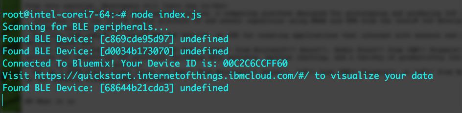

# BLE station with GT

## Introduction
This BLE station example publishes accelerometer data to the IBM Bluemix IoT cloud and also detects any nearby BLE devices.

## Setup
* Ensure that your GT has been updated with the latest build of Ostro-GT
* Ensure that your GT has internet access after setting up WiFi (i.e. using connman)
* Ensure that Bluetooth has been enabled by using the command:
* You will also need a TI SensorTag (CC2650), make sure it is turned on
```
rfkill unblock bluetooth
```

Here is the hardware setup:

Connect male to male wires from the headers on the GT to the grove shield, as shown below


Then plug in the LCD screen to the grove shield on the I2C connector closest to the A0 connector, and the 3-axis accelerometer to the second I2C port.  You need to connect them in this order because the GT board does not have pull up resistors, and the 3-axis accelerometer has them.



The full setup should look like this


## Running the code
You can launch this project from XDK (after first importing it from XDK IoT Edition), or run it directly on your device:

```
npm install
node index.js
```



## IBM Bluemix IoT
Go to [IBM IoT Quickstart](https://quickstart.internetofthings.ibmcloud.com/#/) and enter your device ID to visualize your accelerometer data.

In order to change your device ID, see the Set your Device ID section of the IBM Quickstart Javascript tutorial https://github.com/intel-iot-devkit/GT_IDF_code_samples/tree/master/ibm-quickstart-javascript#set-your-device-id


