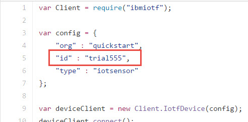
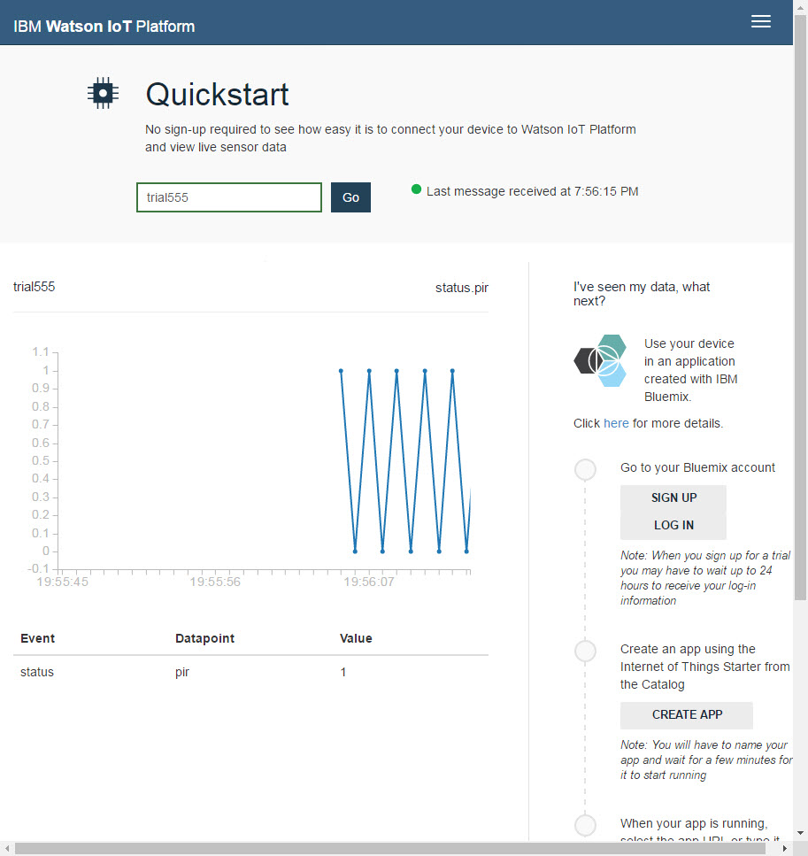

#IBM Bluemix Cloud

##Introduction

This example sends a 1010 pattern to the IBM Bluemix Cloud.

##Setup

Ensure that your Intel® Joule Module has been updated with the latest build of Ostro-GT
Make sure you have an internet connection established on your board.

##Set your Device ID
Edit the "id" field of the 5th line in the index.js file.  It is currently set to "trial555". Rename it something unique.

You can do this on the board by going into that directory 
`cd ibm-quickstart-javascript`

Then edit the index.js file
`vim index.js`

To insert text hit 'i'

Then edit the "id" field, name it something unique

To save, hit ESC, then 
`:wq`

##Running the code

You can launch this project from XDK (after first importing it from XDK IoT Edition), or run it directly on your device:

npm install
node index.js

##IBM Bluemix IoT

Go to IBM IoT Quickstart (https://quickstart.internetofthings.ibmcloud.com) and enter your device ID to visualize the 1010 pattern.  

