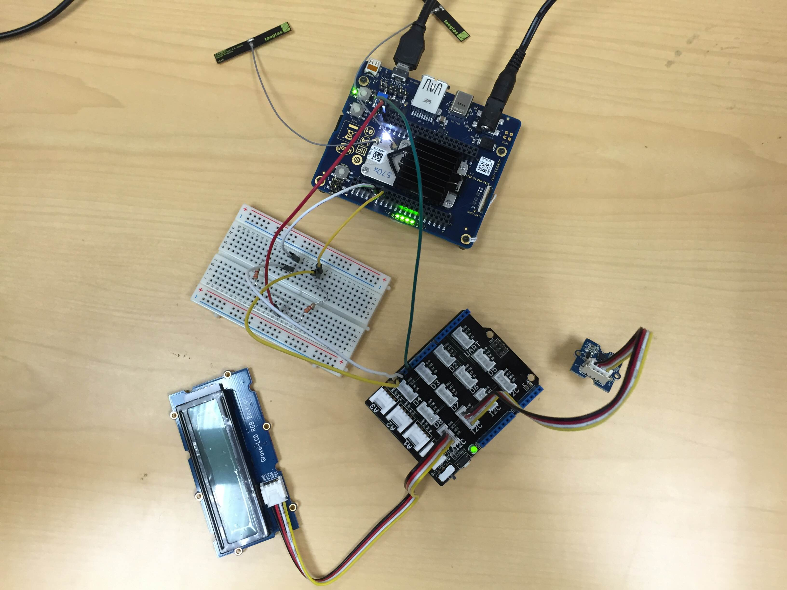

# Earthquake detector in javascript*

## Introduction

This earthquake detector application is part of a series of how-to Intel® Internet of Things (IoT) code sample exercises using the Intel® IoT Developer Kit, Intel® Joule Expansion Board development platform, cloud platforms, APIs, and other technologies.

From this exercise, developers will learn how to:<br>
- Connect the Intel® Joule Expansion Board development platform, a computing platform designed for prototyping and producing IoT and wearable computing products.<br>
- Interface with the Intel® Joule Expansion Board platform IO and sensor repository using MRAA and UPM from the Intel® IoT Developer Kit, a complete hardware and software solution to help developers explore the IoT and implement innovative projects.<br>
- Run this code sample in the Intel® XDK IoT Edition, an IDE for creating applications that interact with sensors and actuators, enabling a quick start for developing software for the Intel® Joule Expansion Board or the Intel® Galileo board.<br>
- Invoke the services of the United States Geological Survey (USGS) API for accessing earthquake data.

## What it is

Using an Intel® Joule Expansion Board, this project lets you create an earthquake detector that:<br>
- senses motion using the digital accelerometer.<br>
- checks live earthquake data, using the USGS API.<br>
- displays the earthquake on the LCD.

## How it works

This earthquake detector constantly reads the 3-axis digital accelerometer looking for movement that could indicate an earthquake.

When it thinks it detects an earthquake, it attempts to verify with the USGS API that an earthquake actually occurred.

If so, it displays a warning on the LCD.

## Hardware requirements

Grove\* Starter Kit Plus, containing:

1. Intel® Joule Expansion Board with an Arduino\* breakout board
2. [Grove\* 3-Axis Digital Accelerometer](http://iotdk.intel.com/docs/master/upm/node/classes/mma7660.html)
3. [Grove\* RGB LCD](http://iotdk.intel.com/docs/master/upm/node/classes/jhd1313m1.html)
4. 3.3 k-ohm resistors (2)
5. Bunch of male to male jumper wires

## Software requirements

1. Intel® XDK IoT Edition

### How to set up

To begin, the project already exists as a template in the Intel® XDK IoT Edition. You can follow the following steps to set it up.

1. Under "START A NEW PROJECT" (to the left of the screen), click on Templates
2. Now select "Earthquake Detector" (more to the centre and the right of the screen) as the template that you want to try out.
3. Now, click on continue at the bottom of the screen.
4. This will prompt you to enter a Project Name and also provide you with an option to change the project directory. Enter a project name here.
5. Now it prompts you to take a tour of XDK, up to you if you want to take a tour.
6. Now you have the code in front of you and you can play around with it as you please.

You need to connect to your Intel® Joule Expansion Board from your computer to send code to it.


Click the **IoT Device** menu at the bottom left. If your Intel® Joule Expansion Board is automatically recognized, select it.


Otherwise, select **Add Manual Connection**.
In the **Address** field, type `192.168.2.15`. In the **Port** field, type `58888`.
Click **Connect** to save your connection.

### Connecting the Grove\* sensors



You need to have a Grove\* Shield connected to the Intel® Joule Expansion Board correctly. Make sure you have the tiny VCC switch on the Grove Shield set to **5V**.
The pin mapping for the Intel® Joule Expansion Board is not the same as the Edison or Galileo board. The Intel® Joule Expansion Board has 2 breakouts which each having 40 pins. You also have access to 4 onboard LEDs. The following are the instructions for hooking up the earthquake detector circuitry.

1. Pin 1 on breakout-2 is the ground pin and Pin 2 can be used to provide the 5V connection. Connect both these pins to the respective pins on the Grove\* Base Shield.
2. Pins 11 and 13 are I2C0SDA and I2C0SCL respectively and are used for I2C bus, these are again on Breakout-1. Plug these pins into a bread board where you would have to create a pull up circuit. This pull up circuit is necessary for the LCD to work. You would be pulling up the voltage on these lines to 5V. You can create this using 2 3.3k-ohm resistors.
3. Plug the other end of the wires from the pull up circuit into the SDA and SCL lines on the Grove\* Base Shield and connect a Grove\* connector cable to connect the RGB LCD to one of the I2C ports on the Grove\* Base Shield.
4. Plug in the Grove\* Digital Accelerometer to another I2C line on the Grove\* Base Shield.

## Configuring the example

To configure the example to check for earthquakes in your area, change the `LATITUDE` key in the `config.json` file as follows:

```
{
  "LATITUDE": "47.641944",
  "LONGITUDE": "-122.127222"
}
```


## Running the program using Intel® XDK IoT Edition

When you're ready to run the example, make sure you have saved all the files.


Click the **Upload** icon to upload the files to the Intel® Joule Expansion Board.


Click the **Run** icon at the bottom of Intel® XDK IoT Edition. This runs the code on the Intel® Joule Expansion Board.


If you made changes to the code, click **Upload and Run**. This runs the latest code with your changes on the Intel® Joule Expansion Board.


You will see output similar to the above when the program is running.

### Determining the Intel® Joule Expansion Board's IP address

You can determine what IP address the Intel® Joule Expansion Board is connected to by running the following command:

    ifconfig
 
You will see output similar to the following:

    wlp1s0    Link encap:Ethernet  HWaddr A4:34:D9:06:A1:F8
			  inet addr:192.168.1.137  Bcast:192.168.1.255  Mask:255.255.255.0
			  inet6 addr: fe80::a634:d9ff:fe06:a1f8%119/64 Scope:Link
			  UP BROADCAST RUNNING MULTICAST  MTU:1500  Metric:1
			  RX packets:39 errors:0 dropped:0 overruns:0 frame:0
			  TX packets:61 errors:0 dropped:0 overruns:0 carrier:0
			  collisions:0 txqueuelen:1000
			  RX bytes:6288 (6.1 KiB)  TX bytes:13215 (12.9 KiB)


The IP address is shown next to `inet`. In the example above, the IP address is `192.168.1.137`.

IMPORTANT NOTICE: This software is sample software. It is not designed or intended for use in any medical, life-saving or life-sustaining systems, transportation systems, nuclear systems, or for any other mission-critical application in which the failure of the system could lead to critical injury or death. The software may not be fully tested and may contain bugs or errors; it may not be intended or suitable for commercial release. No regulatory approvals for the software have been obtained, and therefore software may not be certified for use in certain countries or environments.
