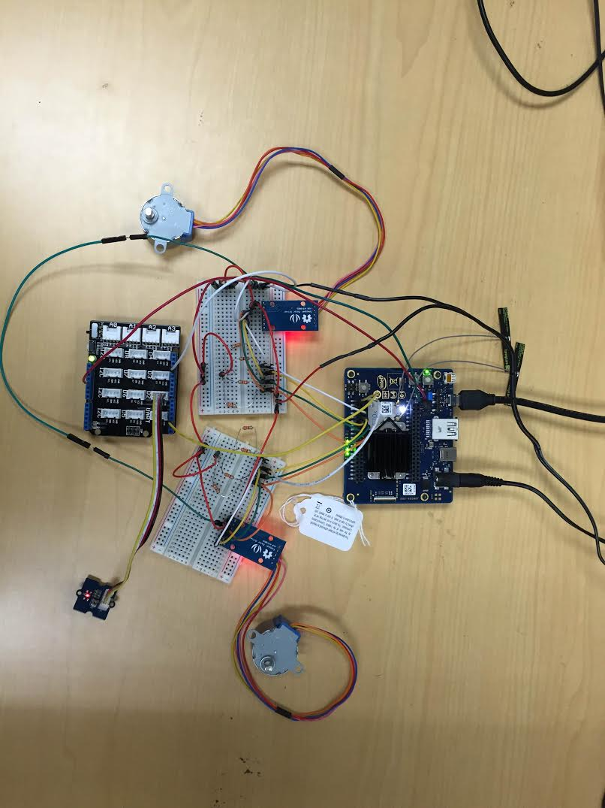

# Line following robot in JavaScript*

## Introduction

This line following robot application is part of a series of how-to Intel IoT code sample exercises using the Intel® IoT Developer Kit, Intel Joule Expansion Board development platform, cloud platforms, APIs, and other technologies.

From this exercise, developers will learn how to:<br>
- Connect the Intel Joule Expansion Board development platform, a computing platform designed for prototyping and producing IoT and wearable computing products.<br>
- Interface with the Intel Joule Expansion Board platform IO and sensor repository using MRAA and UPM from the Intel® IoT Developer Kit, a complete hardware and software solution to help developers explore the IoT and implement innovative projects.<br>
- Run this code sample in Intel® XDK IoT Edition, an IDE for creating applications that interact with sensors and actuators, enabling a quick start for developing software for the Intel Joule Expansion Board.<br>
- Store line detection data using Azure Redis Cache\* from Microsoft\* Azure\*, Redis Store\* from IBM\* Bluemix\*, or ElastiCache\* using Redis\* from Amazon\* Web Services\* (AWS\*), different cloud services for connecting IoT solutions including data analysis, machine learning, and a variety of productivity tools to simplify the process of connecting your sensors to the cloud and getting your IoT project up and running quickly.
- Set up a MQTT-based server using IoT Hub\* from Microsoft\* Azure\*, IoT\* from IBM\* Bluemix\*, or IoT\* from Amazon\* Web Services\* (AWS\*), different cloud machine to machine messaging services based on the industry standard MQTT protocol.

## What it is

Using an Intel Joule Expansion Board board, this project lets you create a line following robot that:<br>
- continuously checks the line finder sensor;<br>
- moves forward if on the line, using the stepper motors;<br>
- tries to pivot to find the line if not on it, using the stepper motors;<br>
- logs events from the line finder sensor, using cloud-based data storage.

## How it works

The line finder robot uses the two attached motors to attempt to follow a line, keeping track of it with the line finder sensor. If on the line, it moves forward. Otherwise, it pivots in place, trying to locate it using the line finder sensor.

Optionally, all data can be stored using the Intel IoT Examples Datastore or an MQTT server running in your own Microsoft\* Azure\*, IBM\* Bluemix\*, or AWS\* account.

## Hardware requirements

Grove* Robotics Kit containing:

1. Intel Joule Expansion Board with an Arduino* breakout board
2. [Grove* Line Finder](http://iotdk.intel.com/docs/master/upm/node/classes/grovelinefinder.html)
3. [Stepper Motor Controller & Stepper Motor](http://iotdk.intel.com/docs/master/upm/node/classes/uln200xa.html) (x2)
4. 3.3 k-ohm resistors (8)
5. Bunch of male to male jumper wires
6. External 5V power supply

## Software requirements

1. Intel® XDK IoT Edition
2. Microsoft\* Azure\*, IBM\* Bluemix\*, or AWS\* account (optional)

### How to set up

To begin, the project already exists as a template in Intel® XDK IoT Edition. You can follow the following steps to set it up.

1. Under "START A NEW PROJECT" (to the left of the screen), click on Templates
2. Now select "Line Following Robot" (more to the centre and the right of the screen) as the template that you want to try out.
3. Now, click on continue at the bottom of the screen.
4. This will prompt you to enter a Project Name and also provide you with an option to change the project directory. Enter a project name here.
5. Now it prompts you to take a tour of XDK, up to you if you want to take a tour.
6. Now you have the code in front of you and you can play around with it as you please.

You need to connect to your Intel Joule Expansion Board board from your computer to send code to it.


Click the **IoT Device** menu at the bottom left. If your Intel Joule Expansion Board is automatically recognized, select it.


Otherwise, select **Add Manual Connection**.
In the **Address** field, type `192.168.2.15`. In the **Port** field, type `58888`.
Click **Connect** to save your connection.

### Connecting the Grove* sensors



You need to have a Grove* Shield connected to an Arduino\*-compatible breakout board to plug all the Grove* devices into the Grove* Shield. Make sure you have the tiny VCC switch on the Grove* Shield set to **5V**.

You need to power Intel Joule Expansion Board with the external power adapter that comes with your starter kit, or substitute it with an external 12V 1.5A power supply. You can also use an external battery, such as a 5V USB battery.

In addition, you need a breadboard and an extra 5V power supply to provide power to both motors. Note: you need a separate battery or power supply for the motors. You cannot use the same power supply for both the Intel Joule Expansion Board board and the motors, so you need either 2 batteries or 2 power supplies in total.

1. Plug each of the stepper motor controllers into 4 pins on the Joule Expansion Board for it to be able to be controlled. Connect stepper motor controller #1 to pins 8, 12, 16 and 20. Connect stepper motor controller #2 to pins 2, 10, 14 and 18. Connect both controllers to ground (GND), to the 5V power coming from the Joule Expansion Board (VCC), and to the separate 5V power for the motors (VM).

2. Plug one end of a Grove* cable into the Grove* Line Finder, and connect the other end to the D2 port on the Grove* Shield. Use a jumper cable to connect the 1st gpio pin on the 1st breakout board to the pin 2 on the base shield.

### Datastore server setup

Optionally, you can store the data generated by this sample program in a backend database deployed using Microsoft\* Azure\*, IBM\* Bluemix\*, or AWS\*, along with Node.js\*, and a Redis\* data store.

For information on how to set up your own cloud data server, go to:

[https://github.com/intel-iot-devkit/intel-iot-examples-datastore](https://github.com/intel-iot-devkit/intel-iot-examples-datastore)

### MQTT* server setup

You can also optionally store the data generated by this sample program using MQTT\*, a machine-to-machine messaging server. You can use MQTT* to connect to Microsoft\* Azure\*, IBM\* Bluemix\*, or AWS\*.

For information on how to connect to your own cloud MQTT* messaging server, go to:

[https://github.com/intel-iot-devkit/intel-iot-examples-mqtt](https://github.com/intel-iot-devkit/intel-iot-examples-mqtt)

## Configuring the example

To configure the example for the optional Microsoft\* Azure\*, IBM\* Bluemix\*, or AWS\* data store, add the `SERVER` and `AUTH_TOKEN` keys to the `config.json` file as follows:

```
{
  "CLOCKWISE": 1,
  "WHITE_LINES": 0,
  "SERVER": "http://intel-examples.azurewebsites.net/logger/line-follower",
  "AUTH_TOKEN": "s3cr3t"
}
```

For information on how to configure the example for the optional Microsoft\* Azure\*, IBM\* Bluemix\*, or AWS\* MQTT messaging server, go to:

[https://github.com/intel-iot-devkit/intel-iot-examples-mqtt/](https://github.com/intel-iot-devkit/intel-iot-examples-mqtt/)

This example uses a server hosted on the Joule board. You will be able to host the server on the board without any significant problems, however, in order to be able to access the application hosted by the server you would need to unblock the ports on the board.
In order to do that please run the following commands:

	$ iptables –F
	$ iptables –P INPUT ACCEPT
	$ iptables –P FORWARD ACCEPT
	$ iptables –P OUTPUT ACCEPT
	$ iptables –S

## Code Changes required for Joule

There are no code changes required to run this example on Joule. You would have to however, change the pin number passed into the constructors of each of the sensor modules that have been initialized.

1. For the Stepper Motor controllers, please pass in the pin numbers 8, 12, 16, 20 for the 1st motor, all of these pins are configured as GPIO. Pins for controller 2: 2, 10, 14, 18.
	var motor = new ULN200XA.ULN200XA(4096, 8, 12, 16, 20);
	var left = new ULN200XA.ULN200XA(4096, 2, 10, 14, 18);

2. For Grove Line Finder sensor, connect that to Pin 1 on the board
	var lineFinder = new (require("jsupm_grovelinefinder").GroveLineFinder)(1);

## Running the program using Intel® XDK IoT Edition

When you're ready to run the example, make sure you saved all the files.


Click the **Upload** icon to upload the files to the Intel Joule Expansion Board board.


Click the **Run** icon at the bottom of Intel® XDK IoT Edition. This runs the code on Intel Joule Expansion Board.


If you made changes to the code, click **Upload and Run**. This runs the latest code with your changes on Intel Joule Expansion Board.


You will see output similar to the above when the program is running.

### Determining the Intel Joule Expansion Board IP address

You can determine what IP address the Intel® Joule Expansion board is connected to by running the following command:

    ifconfig
 
You will see output similar to the following:

    wlp1s0    Link encap:Ethernet  HWaddr A4:34:D9:06:A1:F8
			  inet addr:192.168.1.137  Bcast:192.168.1.255  Mask:255.255.255.0
			  inet6 addr: fe80::a634:d9ff:fe06:a1f8%119/64 Scope:Link
			  UP BROADCAST RUNNING MULTICAST  MTU:1500  Metric:1
			  RX packets:39 errors:0 dropped:0 overruns:0 frame:0
			  TX packets:61 errors:0 dropped:0 overruns:0 carrier:0
			  collisions:0 txqueuelen:1000
			  RX bytes:6288 (6.1 KiB)  TX bytes:13215 (12.9 KiB)


The IP address is shown next to `inet`. In the example above, the IP address is `192.168.1.137`.

IMPORTANT NOTICE: This software is sample software. It is not designed or intended for use in any medical, life-saving or life-sustaining systems, transportation systems, nuclear systems, or for any other mission-critical application in which the failure of the system could lead to critical injury or death. The software may not be fully tested and may contain bugs or errors; it may not be intended or suitable for commercial release. No regulatory approvals for the software have been obtained, and therefore software may not be certified for use in certain countries or environments.

